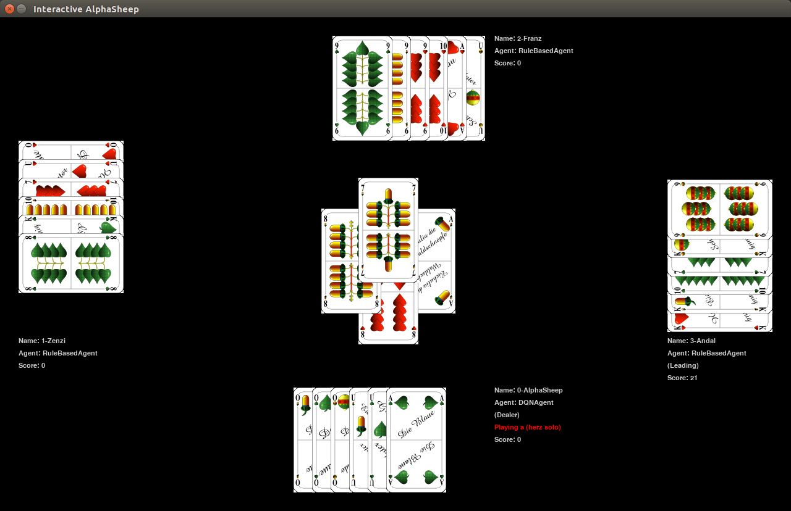

# AlphaSheep - Reinforcement Learning for Schafkopf

---
### Why Schafkopf?

[Schafkopf](https://en.wikipedia.org/wiki/Schafkopf) (English: sheep-head) is a traditional Bavarian card game, and the most popular in Bavaria. 

In my free time, I love playing Schafkopf with my friends! It is a game of many rules, some explicit and some implicit. Since the game is a social activity, people often play "traditionally", in ways that their friends expect. If you can these unwritten rules then it's actually easy: Just play in exactly this way, and you will be a fine player.    

So I've always wondered: is the traditional way optimal? Or can we find better ways of playing? If we train virtual agents, will they converge towards the traditional rules? Or is it possible to open up new playstyles? And, can we extract new "rules" from that?

Plus, I've always wanted to try out RL :) It is not the main focus of my research, but where's the fun in that?
Schafkopf seems ideal to learn about the many facets of RL, because it is:
1. **Easy**: It is not overly complex (a single game consists of only 8 steps, during which a player has very limited actions).
2. **Not so easy**: The game has hierarchical elements: before the game, players bid against each other in an auction, and the winner is then allowed to determine the game contract. The rules change according to this contract, and in some contracts a player can win or lose a large sum of money.
3. **Hard**: Schafkopf is partially observable, so we can never play it perfectly. Some very critical actions, such as "schießen" (doubling the stakes), are typically taken in a gamble, before any cards are revealed.
4. **Cooperative**: Some game contracts require players to cooperate (and even communicate). It would be interesting to see if agents communicate in ways that human players usually do.

#### Current state:
- Stage 1 **(DONE)**: Create an agent that can play a single game in a single game mode really well. 
- Stage 2: Extend to all game modes, and include the bidding phase. Explore hierarchical planning.
- Stage 3: Add money into the equation and have agents maximize return over an entire series of games.
- Stage 4: Explore cooperative play with humans.
 
For a long list of notes, see my experiment log in [experiment_log.md](experiment_log.md)!

---

### Try it out:

Requirements:
- Python 3.6+
- `pip3 install -r requirements.txt`

How to run:
- `./run_example.sh`: Watch a pretrained version of AlphaSheep play a suit-solo against baseline agents.
- `./run_user.sh`: Play a suit-solo against baseline agents. How well can you do?
- Play vs AlphaSheep.... coming soon!

---

### Project Overview
#### Simulator
- Mostly implemented: can run all major game modes.
- Bidding phase is still missing
- Currently only simulates single games (not keeping tabs over multiple rounds)
- Consequently, there is no "money" counting right now.
- Main classes: GameController, GameState

#### GUI
- Basic PyGame implementation
- Completely optional - can be attached via event subscriber
- Single-threaded: blocks after every move, so the user can step through a game
- Currently, the user can observe agents play, or play themselves via the GuiAgent.

#### Agents
- Are asked for a card to play, based on the following information:
    - Current cards in (own) hand
    - Cards in current trick (on the table, played other players)
- Are notified of trick and game results.
- RandomCardAgent: Baseline that plays a random card that does not violate the rules.
- RuleBasedAgent: Plays according to rules that a human would also observe.
- DQNAgent: First try at a super-basic RL learner. After some tuning, it performs quite well!
